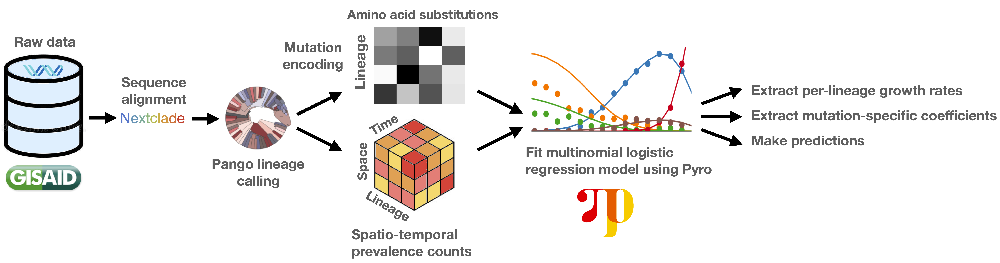

[](https://github.com/broadinstitute/pyro-cov/actions)
[](https://github.com/broadinstitute/pyro-cov/releases)
[](https://www.medrxiv.org/content/10.1101/2021.09.07.21263228v1)

# Pyro models for SARS-CoV-2 analysis



Supporting material for the paper ["Analysis of 2.1 million SARS-CoV-2 genomes identifies mutations associated with transmissibility"](https://www.medrxiv.org/content/10.1101/2021.09.07.21263228v1). Figures and supplementary data for that paper are in the [paper/](paper/) directory.

This is open source, but we are not intending to support code for use by outside groups. To use outputs of this model, we recommend ingesting the tables [strains.tsv](paper/strains.tsv) and [mutations.tsv](paper/mutations.tsv).

## Reproducing

### Install software

Clone this repository:
```sh
git clone git@github.com:broadinstitute/pyro-cov
cd pyro-cov
```

Install this python package:
```py
pip install -e .
```

### Get access to GISAID data

Work with GISAID to get a data agreement.
Define the following environment variables:
```
GISAID_USERNAME
GISAID_PASSWORD
GISAID_FEED
```
For example my username is `fritz` and my gisaid feed is `broad2`.

### Download data
This downloads data from GISAID and clones repos for other data sources.
```sh
make update
```

### Preprocess data

This takes under an hour.
Results are cached in the `results/` directory, so re-running on newly pulled data should be able to re-use alignment and PANGOlineage classification work.
```sh
make preprocess
```

### Analyze data
```sh
make analyze
```

### Generate plots and tables
Plots and tables are generated by running various notebooks:
- [mutrans.py](notebooks/mutrans.ipynb)
- [mutrans_backtesting.py](notebooks/mutrans_backtesting.ipynb)
- [mutrans_gene.ipynb](notebooks/mutrans_gene.ipynb)

## Citing

If you use this software or predictions in the [paper](paper/) directory please consider citing:

```
@article {Obermeyer2021.09.07.21263228,
  author = {Obermeyer, Fritz and
            Schaffner, Stephen F. and
            Jankowiak, Martin and
            Barkas, Nikolaos and
            Pyle, Jesse D. and
            Park, Daniel J. and
            MacInnis, Bronwyn L. and
            Luban, Jeremy and
            Sabeti, Pardis C. and
            Lemieux, Jacob E.},
  title = {Analysis of 2.1 million SARS-CoV-2 genomes identifies mutations associated with transmissibility},
  elocation-id = {2021.09.07.21263228},
  year = {2021},
  doi = {10.1101/2021.09.07.21263228},
  publisher = {Cold Spring Harbor Laboratory Press},
  URL = {https://www.medrxiv.org/content/early/2021/09/13/2021.09.07.21263228},
  eprint = {https://www.medrxiv.org/content/early/2021/09/13/2021.09.07.21263228.full.pdf},
  journal = {medRxiv}
}
```
