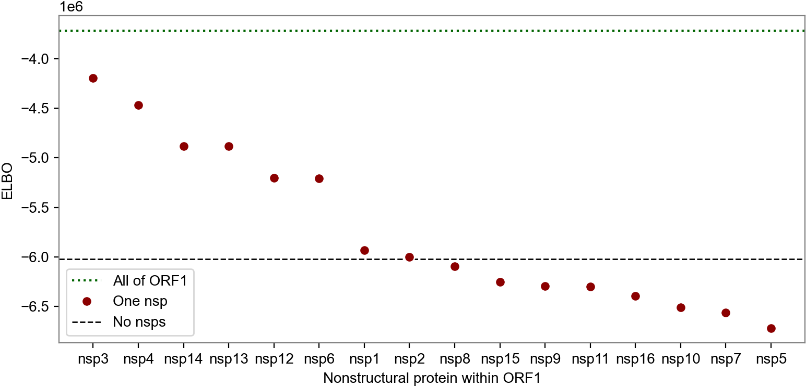
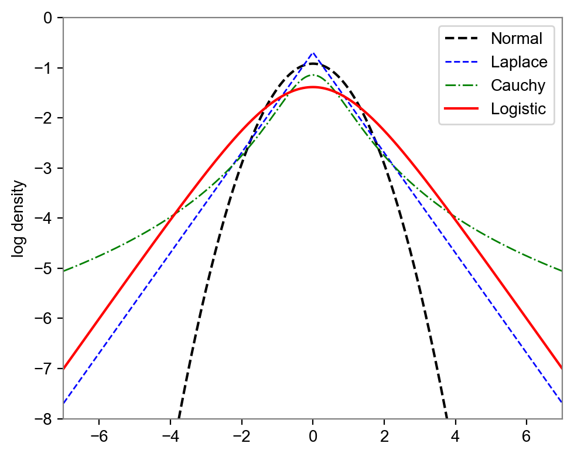

# Images and data for publication

The results in this directory are generated by the following Jupyter notebooks:
[ `mutrans.ipynb` ](../mutrans.ipynb),
[ `mutrans_gene.ipynb` ](../mutrans_gene.ipynb),
[ `mutrans_prediction.ipynb` ](../mutrans_prediction.ipynb),
[ `mutrans_backtesting.ipynb` ](../mutrans_backtesting.ipynb).

## Data tables

- [Mutation table](mutations.tsv) is ranked by statistical significance.
  The "mean" field denotes the estimated effect on log growth rate of each mutation.
- [Lineage table](strains.tsv) is ranked by growth rate.

## Manhattan plots

## Information density plots

## Volcano plot

## Strain characterization plots

## Cross validation plots

The following plots assess robustness via 2-fold crossvalidation, splitting data into Europe versus (World w/o Europe).

## Misc plots

## Acknowledgements

We gratefully acknowledge all data contributors, i.e. the Authors and their Originating laboratories responsible for obtaining the specimens, and their Submitting laboratories for generating the genetic sequence and metadata and sharing via the GISAID initiative [1,2] on which this research is based. A total of 2,160,748 submissions are included in this study. A complete list of 2.1million accession numbers are available in [accession_ids.txt.zip](accession_ids.txt.zip).

1.  GISAID Initiative and global contributors,
    EpiCoV(TM) human coronavirus 2019 database.
    GISAID (2020), (available at https://gisaid.org).
2.  S. Elbe, G. Buckland-Merrett,
    Data, disease and diplomacy: GISAID's innovative contribution to global health.
    Glob Chall. 1, 33-46 (2017).
