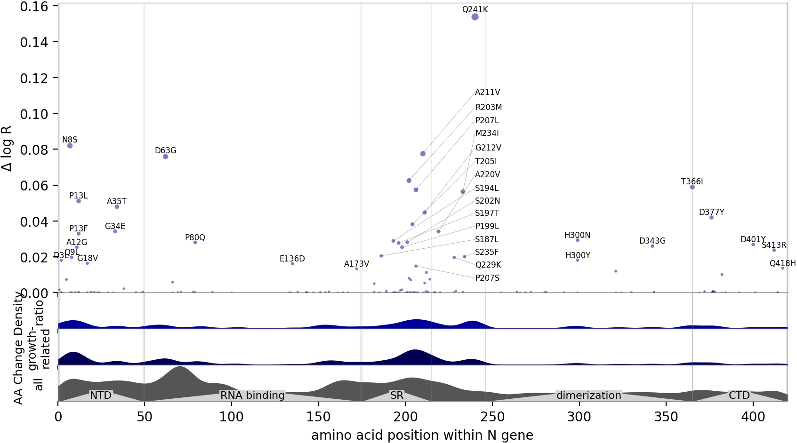

# Images and data for publication

The results in this directory are generated by the following Jupyter notebooks:
[ `mutrans.ipynb` ](../mutrans.ipynb),
[ `mutrans_gene.ipynb` ](../mutrans_gene.ipynb),
[ `mutrans_prediction.ipynb` ](../mutrans_prediction.ipynb),
[ `mutrans_backtesting.ipynb` ](../mutrans_backtesting.ipynb).

## Data tables

- [Mutation table](mutations.tsv) is ranked by statistical significance.
  The "mean" field denotes the estimated effect on log growth rate of each mutation.
- [Lineage table](strains.tsv) is ranked by growth rate.

## Manhattan plots

## Information density plots

## Volcano plot

## Strain characterization plots

## Cross validation plots

The following plots assess robustness via 2-fold crossvalidation, splitting data into Europe versus (World w/o Europe).

## Misc plots

