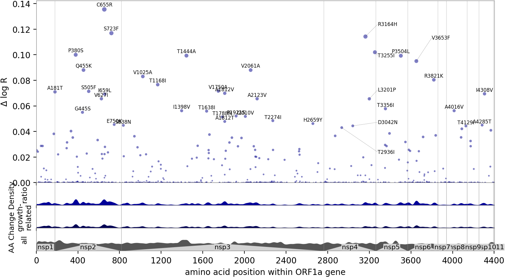
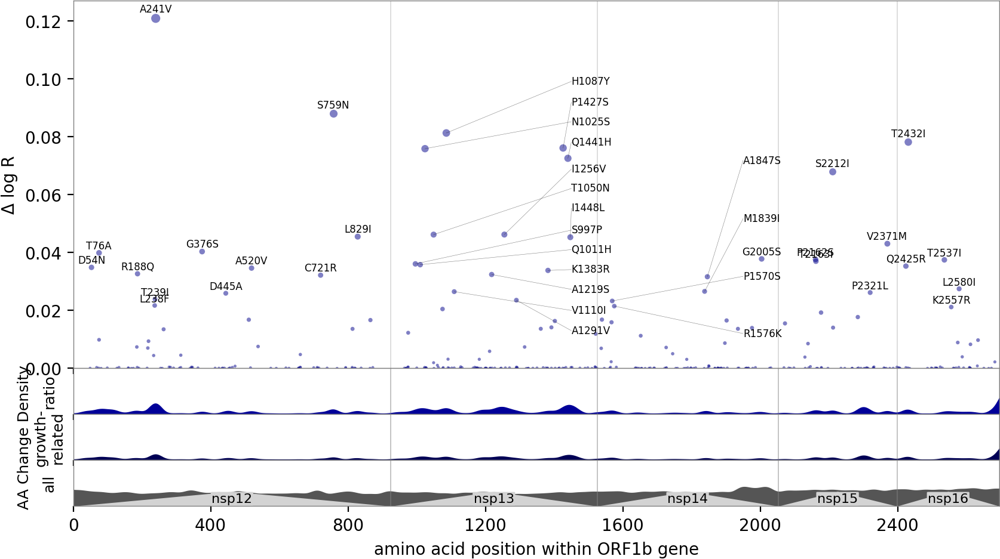
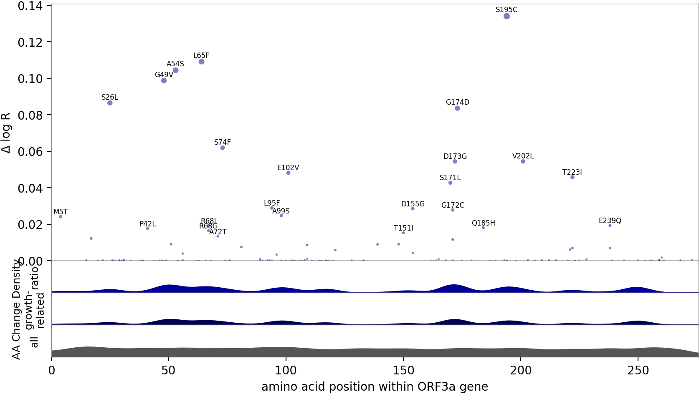
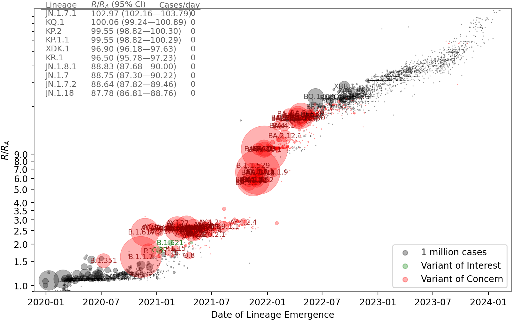
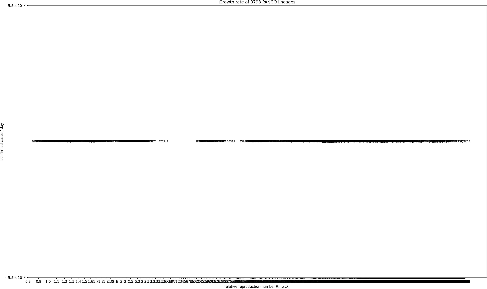
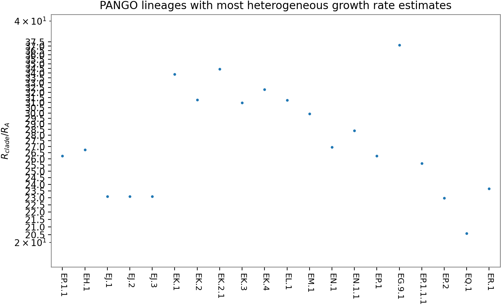

# Images and data for publication

This directory contains figures and tables output by the [PyR0
model](https://www.medrxiv.org/content/10.1101/2021.09.07.21263228v1). These
outputs are aggregated to weeks, PANGO lineages, and amino acid changes.

Figures and tables are generated by first running preprocessing and inference,
then postprocessing with the following Jupyter notebooks:
[ `mutrans.ipynb` ](../mutrans.ipynb),
[ `mutrans_gene.ipynb` ](../mutrans_gene.ipynb),
[ `mutrans_prediction.ipynb` ](../mutrans_prediction.ipynb),
[ `mutrans_backtesting.ipynb` ](../mutrans_backtesting.ipynb).

## Data tables

- [Mutation table](mutations.tsv) is ranked by statistical significance.
  The "mean" field denotes the estimated effect on log growth rate of each mutation.
- [Lineage table](strains.tsv) is ranked by growth rate.

## Manhattan plots

## Information density plots

## Volcano plot

## Strain characterization plots

## Cross validation plots

The following plots assess robustness via 2-fold crossvalidation, splitting data into Europe versus (World w/o Europe).

## Data plots

## Acknowledgements

The aggregated model outputs in this directory were generated from data inputs
including either GISAID records (https://gisaid.org), an UShER tree placement
of those records
(http://hgdownload.soe.ucsc.edu/goldenPath/wuhCor1/UShER_SARS-CoV-2), PANGO
lineage classifications (https://cov-lineages.org), and case count time series
from Johns-Hopkins University (https://github.com/CSSEGISandData/COVID-19).
Results in this directory can alternatively be generated using GENBANK records
(https://www.ncbi.nlm.nih.gov) instead of GISAID records.

We gratefully acknowledge all data contributors, i.e. the Authors and their Originating laboratories responsible for obtaining the specimens, and their Submitting laboratories for generating the genetic sequence and metadata and sharing via the GISAID initiative [1,2] on which this research is based. A total of 6,466,299 submissions are included in this study. A complete list of the 6,466,299 accession numbers is available in [accession_ids.txt.xz](accession_ids.txt.xz).

1.  GISAID Initiative and global contributors,
    EpiCoV(TM) human coronavirus 2019 database.
    GISAID (2020), (available at https://gisaid.org).
2.  S. Elbe, G. Buckland-Merrett,
    Data, disease and diplomacy: GISAID's innovative contribution to global health.
    Glob Chall. 1, 33-46 (2017).
3.  National Center for Biotechnology Information (NCBI)[Internet].
    Bethesda (MD): National Library of Medicine (US),
    National Center for Biotechnology Information;
    [1988] – [cited 2017 Apr 06].
    Available from: https://www.ncbi.nlm.nih.gov
