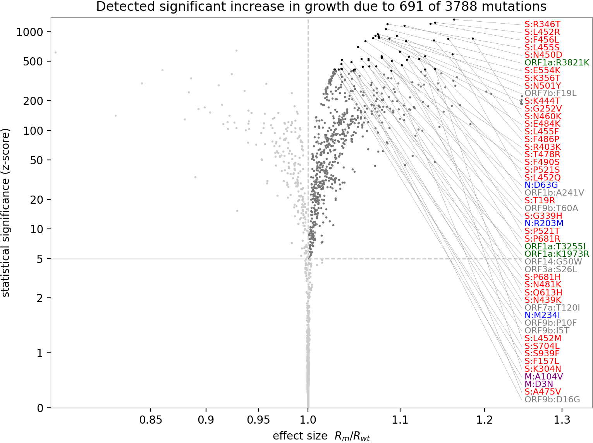

# Analysis of 1,000,000 virus genomes reveals determinants of relative growth rate

Fritz Obermeyer, Jacob Lemieux, Stephen Schaffner, Daniel Park

## Abstract

We fit a large logistic growth regression model to sequenced genomes of SARS-CoV-2 samples distributed in space (globally) and time (late 2019 -- early 2021).
This model attributes relative changes in transmissibility to each observed mutation, aggregated over >800 PANGO lineages.
Results show that one region of the N gene is particularly important in determining transmissibility, followed by the S gene and the ORF3a gene.

## Discussion

Note that many of the most transmissibility-influencing mutation occur in the N gene and particularly at positions 28800--29000 (see Figure TODO).

## Materials and methods

### Model

We model the strain distribution over time as a softmax of a set of linear growth functions, one per strain; this is the multivariate generalization of the standard logistic growth model.
Further, we factorize the growth rate of each strain as a sum over growth rates of the mutations in that strain:
```
strain_portion = softmax(strain_init + mutation_rate @ mutations_per_strain)
```
Our hierarchical probabilistic model includes latent variables for:
- global feature regularization parameter (how sparse are the features?).
- initial strain prevalence in each (region, strain).
- rate coefficients of each mutation, with a Laplace prior.
- global observation concentration (how noisy are the observations?).

The model uses a Dirichlet-multinomial likelihood (the multivariate
generalization of negative binomial) with learned shared concentration parameter.

TODO add graphical model figure

This model is robust to a number of sources of bias:
- Sampling bias across regions (it's fine for one region to sample 100x more than another)
- Sampling bias over time (it's fine to change sampling rate over time)
- Change in absolute growth rate of all strains, in any (region, time) cell (i.e. the model is robust to changes in local policies or weather, as long as those changes equally affect all strains).

However the model is susceptible to the following sources of bias:
- Biased sampling in any (region,time) cell (e.g. sequencing only in case of S-gene target failure).
- Changes in sampling bias within a single region over time (e.g. a country has a lab in only one city, then spins up a second lab in another distant city with different strain portions).

TODO We considered the possibility of biased submission to the GISAID database, and analyzed the CDC NS3 dataset, finding similar results.

## Inference

We use a combination of MAP estimation and stochastic variational inference.
We MAP estimate the global parameters and initial strain prevalences.
For the remaining mutation-transmissibility latent variable we would like to estimate statistical significance, so we fit a mean-field variational distribution: independent normal distributions with learned means and variances.
While the mean field assumption leads to underdispersion on an absolute scale, it nevertheless allows us to rank the _relative statistical significance_ of different mutations.
This relative ranking is sufficient for the purposes of this paper: to focus attention on mutations and regions of the SARS-CoV-2 genome that appear to be linked to increased transmissibility.

Inverence is performed via the Pyro probabilistic programming language.
Source code is available at [github.com/broadinstitute/pyro-cov](https://github.com/broadinstitute/pyro-cov).

## References

- Eli Bingham, Jonathan P. Chen, Martin Jankowiak, Fritz Obermeyer, Neeraj Pradhan,
  Theofanis Karaletsos, Rohit Singh, Paul Szerlip, Paul Horsfall, Noah D. Goodman
  (2018)
  "Pyro: Deep Universal Probabilistic Programming"
  https://arxiv.org/abs/1810.09538

## Tables

1. [Top Mutations](top_mutations.md)
2. [Top Strains](top_strains.md)

## Figures

[](manhattan.pdf)

[](volcano.pdf)
