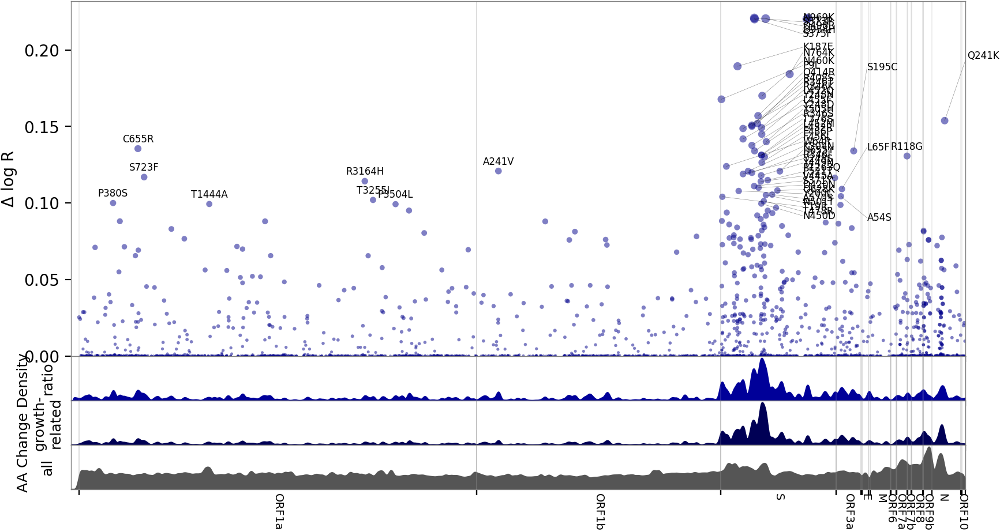

# Analysis of 1,000,000 virus genomes reveals determinants of relative growth rate

Jacob Lemieux, Fritz Obermeyer, Stephen Schaffner, Daniel Park

## Abstract

We fit a large logistic growth regression model to sequenced genomes of SARS-CoV-2 samples distributed in space (globally) and time (late 2019 -- early 2021).
This model attributes relative changes in transmissibility to each observed mutation, aggregated over >800 PANGO lineages.
Results show that one region of the N gene is particularly important in determining transmissibility, followed by the S gene and the ORF3a gene.

## Materials and methods

We considered the possibility of biased submission to the GISAID database, and analyzed the CDC NS3 dataset, finding similar results.

## Figures

## Tables

1. [Top Mutations](top_mutations.md)
1. [Top Strains](top_strains.md)
