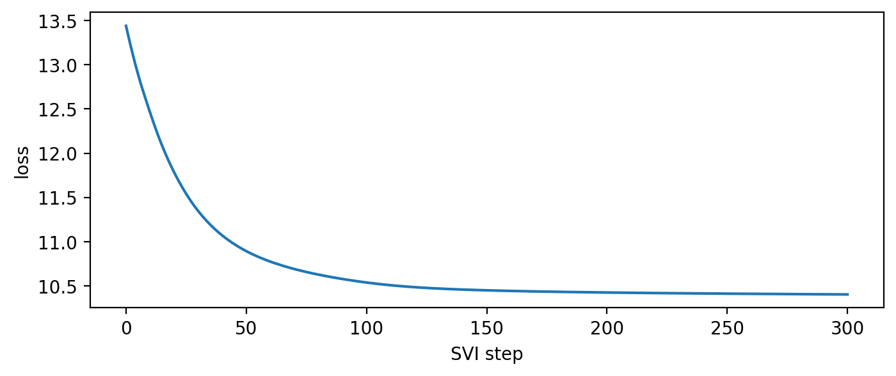
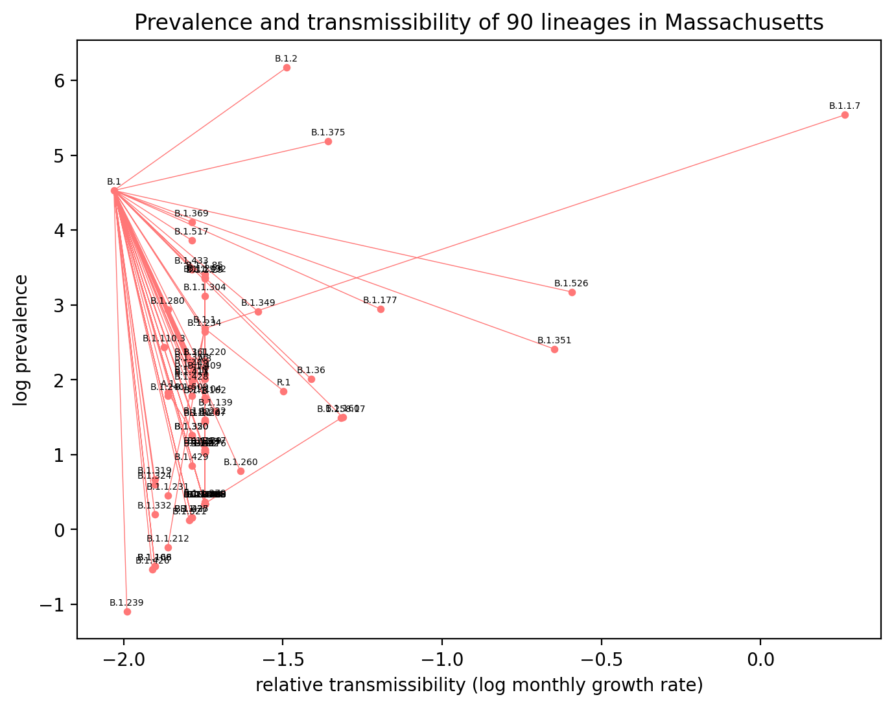
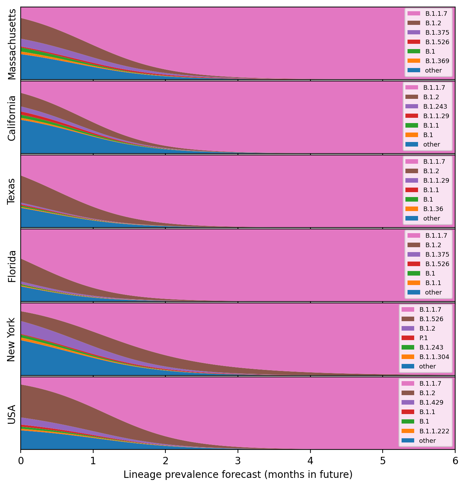

# Modeling relative strain prevalence

This notebook explores Pyro models for forecasting relative strain prevalance based on GISAID sequence data labeled with Pangolin lineage and kmer features.


```python
import math
import pickle
from collections import Counter
import matplotlib
import matplotlib.pyplot as plt
import torch
import pyro
import pyro.distributions as dist
from pyro.infer import SVI, Trace_ELBO, Trace_ELBO
from pyro.infer.autoguide import AutoDelta, AutoNormal, init_to_median
from pyro.optim import Adam, ClippedAdam
from pyrocov import pangolin

matplotlib.rcParams['figure.dpi'] = 200
```

## Loading data

We'll use all GISAID data. You'll need to request a feed from gisaid.org, download, then run
```sh
python preprocess_gisaid.py
python featurize_gisaid.py
```


```python
with open("results/gisaid.columns.pkl", "rb") as f:
    columns = pickle.load(f)
print("Training on {} rows with columns:".format(len(columns["day"])))
print(", ".join(columns.keys()))
```

    Training on 579250 rows with columns:
    accession_id, collection_date, location, add_location, lineage, day


```python
lineages = list(map(pangolin.compress, columns["lineage"]))
print(f"Top 12 of {len(set(lineages))} lineages")
print("-" * 30)
for lineage, count in Counter(lineages).most_common(12):
    print(f"{count: >10d} {lineage}")
```

    Top 12 of 881 lineages
    ------------------------------
         90459 B.1.1.7
         81788 B.1.177
         54639 B.1
         34030 B.1.2
         19886 B.1.1.29
         15224 B.1.160
         12226 D.2
          8606 B.1.177.21
          7809 C
          6610 B.1.1.284
          6234 B.1.258
          6146 B.1.221


```python
locations = columns["location"]
print(f"Top 12 of {len(set(locations))} lineages")
print("-" * 30)
for location, count in Counter(locations).most_common(12):
    print(f"{count: >10d} {location}")
```

    Top 12 of 6225 lineages
    ------------------------------
        195058 Europe / United Kingdom / England
         26825 Europe / United Kingdom / Wales
         18946 Europe / Denmark / Hovedstaden
         16293 Europe / United Kingdom / Scotland
         15728 Asia / Japan
         13556 Oceania / Australia / Victoria
         12406 North America / USA / Texas / Houston
          7405 Europe / Denmark / Syddanmark
          7008 Europe / Denmark / Midtjylland
          6362 North America / USA / Michigan
          6089 Europe / Denmark / Sjaelland
          6040 North America / USA / Utah


```python
kmer_features = torch.load("results/gisaid.kmer_features.pt")
print(kmer_features.keys())
```

    dict_keys(['args', 'pangolin_mapping', 'lineages', 'features'])


```python
print(kmer_features["features"].shape)
```

    torch.Size([371, 32])


## Aggregating regions and lineages

We'll aggregate rare lineages into their parents, and aggregate locations by either US state, UK regions, or other country.


```python
features = kmer_features["features"]
mapping = kmer_features["pangolin_mapping"]
lineages = list(map(pangolin.compress, columns["lineage"]))
lineages = [mapping.get(x, x) for x in lineages]
lineage_id_inv = kmer_features["lineages"]
lineage_id = {k: i for i, k in enumerate(lineage_id_inv)}
```


```python
sparse_data = Counter()
location_id = {}
for day, location, lineage in zip(columns["day"], columns["location"], lineages):
    parts = location.split("/")
    if len(parts) < 2:
        continue
    parts = [p.strip() for p in parts[:3]]
    if parts[1] not in ("USA", "United Kingdom"):
        parts = parts[:2]
    location = " / ".join(parts)
    x = location_id.setdefault(location, len(location_id))
    s = lineage_id[lineage]
    t = day // 7
    sparse_data[t, x, s] += 1
    
T = 1 + max(columns["day"]) // 7
P = len(location_id)
S = len(lineage_id)
dense_data = torch.zeros(T, P, S)
for (t, p, s), n in sparse_data.items():
    dense_data[t, p, s] = n
print(dense_data.shape)
```

    torch.Size([64, 227, 371])


## Constructing a Pyro model

Our first model is a logistic growth model with a Dirichlet-multinomial likelihood (the multivariate generalization of negative binomial likelihood). This ignores any spatial structure across regions.


```python
def model(dense_data, features, feature_scale=1.0):
    assert dense_data.shape[-1] == features.shape[0]
    T, P, S = dense_data.shape
    S, F = features.shape
    time_plate = pyro.plate("time", T, dim=-2)
    place_plate = pyro.plate("place", P, dim=-1)
    time = torch.arange(float(T)) * 7 / 365.25  # in years
    time -= time.max()
    
    # Assume relative growth rate depends on kmer features but not time or place.
    log_rate_coef = pyro.sample(
        "log_rate_coef",
        dist.Laplace(0, feature_scale).expand([F]).to_event(1),
    )
    log_rate = pyro.deterministic("log_rate", log_rate_coef @ features.T)

    # Assume places differ only in their initial infection count.
    with place_plate:
        log_init = pyro.sample(
            "log_init",
            dist.Normal(0, 10).expand([S]).to_event(1),
        )

    # Finally observe overdispersed counts.
    concentration = pyro.sample("concentration", dist.LogNormal(2, 4))
    base_rate = (log_init + log_rate * time[:, None, None]).softmax(dim=-1)
    with time_plate, place_plate:
        pyro.sample(
            "obs",
            dist.DirichletMultinomial(
                total_count=dense_data.sum(-1).max(),
                concentration=concentration * base_rate,
                is_sparse=True,  # uses a faster algorithm
            ),
            obs=dense_data,
        )
```

## Fitting the model

We'll use simple MAP estimation via Pyro's SVI and an `AutoDelta` guide. I'm defining a custom initialization function to initialize forecasts to uniformly even rather than random.


```python
def init_loc_fn(site):
    if site["name"] in ("log_init", "log_rate_coef"):
        return torch.zeros(site["fn"].shape())
    return init_to_median(site)
```


```python
%%time
pyro.clear_param_store()
pyro.set_rng_seed(20210223)

num_steps = 301
guide = AutoDelta(model, init_loc_fn=init_loc_fn)
guide(dense_data, features)  # Initializes guide so we can count parameters.
print("Traning guide with {} parameters:".format(sum(p.numel() for p in guide.parameters())))
optim = Adam({"lr": 0.05})
svi = SVI(model, guide, optim, Trace_ELBO())
losses = []
num_obs = dense_data.count_nonzero()
for step in range(num_steps):
    loss = svi.step(dense_data, features) / num_obs
    assert not math.isnan(loss)
    losses.append(loss)
    if step % 20 == 0:
        median = guide.median()
        concentration = median["concentration"].item()
        print(f"step {step: >4d} loss = {loss:0.3g}\t"
              f"conc. = {concentration:0.3g}")
        
plt.figure(figsize=(8, 3))
plt.plot(losses)
plt.xlabel("SVI step")
plt.ylabel("loss");
```

    Traning guide with 84250 parameters:
    step    0 loss = 13.4	conc. = 1.08
    step   20 loss = 11.8	conc. = 2.78
    step   40 loss = 11.1	conc. = 5.31
    step   60 loss = 10.8	conc. = 7.14
    step   80 loss = 10.6	conc. = 8.76
    step  100 loss = 10.5	conc. = 10.9
    step  120 loss = 10.5	conc. = 13.1
    step  140 loss = 10.5	conc. = 14.8
    step  160 loss = 10.4	conc. = 15.6
    step  180 loss = 10.4	conc. = 16
    step  200 loss = 10.4	conc. = 16.3
    step  220 loss = 10.4	conc. = 16.4
    step  240 loss = 10.4	conc. = 16.6
    step  260 loss = 10.4	conc. = 16.7
    step  280 loss = 10.4	conc. = 16.8
    step  300 loss = 10.4	conc. = 16.8
    CPU times: user 1min 7s, sys: 5.62 s, total: 1min 12s
    Wall time: 34.2 s


    Text(0, 0.5, 'loss')


    

    


After fitting, we can extract a point estimate via the `guide.median()` method, which returns a dict.


```python
with torch.no_grad():
    median = {k: v.detach() for k, v in guide.median().items()}
median["log_rate"] = median["log_rate_coef"] @ features.T
print(", ".join(median.keys()))
```

    log_rate_coef, log_init, concentration, log_rate


## Interpreting results

Since we're fitting relative growth rate and prevalence, we can characterize all lineages by these quantities. Note the relative transmissibility looks suspciously diverse, suggesting we should probably add process noise to our model.


```python
x = features.clamp(min=0).mean(0)
y = features.neg().clamp(min=0).mean(0)
coef = median["log_rate_coef"] * 100
pos = coef.clamp(min=0)
neg = coef.neg().clamp(min=0)
plt.figure(figsize=(6, 4))
plt.scatter(x, y, pos, color="red", alpha=0.5, lw=0)
plt.scatter(x, y, neg, color="blue", alpha=0.5, lw=0)
plt.xlabel("present")
plt.ylabel("absent");
```


    

    


```python
x = median["log_rate_coef"].sort(0).values
plt.figure(figsize=(6, 3))
plt.plot(x, 'k.', lw=0, markersize=0.5)
plt.axhline(0, color='black', lw=0.5, alpha=0.5);
```


    

    


```python
edges = pangolin.find_edges(list(lineage_id))
edges = torch.tensor([[lineage_id[u], lineage_id[v]] for u, v in edges], dtype=torch.long)

def plot_prevalence(place_query="", max_len=999):
    ids = [i for name, i in location_id.items() if place_query in name]
    local_lineages = dense_data.sum(0)[ids].sum(0).nonzero(as_tuple=True)[0]
    assert ids, "no locations matching " + place_query
    log_rate = median["log_rate"] / 12
    log_init = median["log_init"][ids].logsumexp(0)
    plt.figure(figsize=(8, 6))
    plt.scatter(log_rate[local_lineages], log_init[local_lineages], s=10, color="#ff7777")
    X, Y = [], []
    for u, v in edges.tolist():
        if u in local_lineages and v in local_lineages:
            X.extend([log_rate[u], log_rate[v], None])
            Y.extend([log_init[u], log_init[v], None])
    plt.plot(X, Y, color="#ff7777", lw=0.5)
    for name, i in lineage_id.items():
        if i in local_lineages and len(name) <= max_len:
            plt.text(log_rate[i], log_init[i] + 0.08, name,
                     fontsize=5, horizontalalignment="center")
    plt.ylabel("log prevalence")
    plt.xlabel("relative transmissibility (log monthly growth rate)")
    plt.title(f"Prevalence and transmissibility of {len(local_lineages)} lineages"
              + (" in " + place_query if place_query else " globally"));
    
plot_prevalence(max_len=7)
```


    

    


```python
plot_prevalence("Massachusetts")
```


    

    


Finally we can use our logistic curves to forecast lineage prevalence in each region:


```python
def plot_decomposition(queries, num_parts=7):
    if isinstance(queries, str):
        queries = [queries]
    fig, axes = plt.subplots(len(queries), figsize=(8, 1 + 1.2 * len(queries)), sharex=True)
    for row, (place_query, ax) in enumerate(zip(queries, axes)):
        names = [name for name, i in location_id.items() if place_query in name]
        ids = [location_id[name] for name in names]
        assert ids, "no locations matching " + place_query
        log_rate = median["log_rate"]
        # FIXME this ignores region population when aggregating:
        log_init = median["log_init"][ids].logsumexp(0)
        assert log_init.shape == log_rate.shape
        time = torch.linspace(0, 0.5, 100)
        portion = (log_init + log_rate * time[:, None]).softmax(-1)

        # Aggregate into top + others.
        best = portion.sum(0).sort(0, descending=True).indices
        parts = {"other": None}
        for i in range(num_parts - 1):
            i = best[num_parts - i - 2].item()
            parts[lineage_id_inv[i]] = portion[:, i].clone()
            portion[:, i] = 0
        parts["other"] = portion.sum(-1)
        months = time * 12

        ax.stackplot(months, *parts.values(), labels=tuple(parts))
        ax.set_xlim(months.min(), months.max())
        ax.set_ylim(0, 1)
        ax.set_yticks(())
        ax.set_ylabel(names[0].split("/")[-1].strip() if len(names) == 1 else place_query)
        if row == len(axes) - 1:
            ax.set_xlabel("Lineage prevalence forecast (months in future)")
        handles, labels = ax.get_legend_handles_labels()
        ax.legend(handles[::-1], labels[::-1], loc="lower right", prop={"size": 6.5})
    plt.subplots_adjust(hspace=0.02);

plot_decomposition(["Mass", "Calif", "Texas", "Florida", "New York", "USA"])
```


    

    


```python

```
